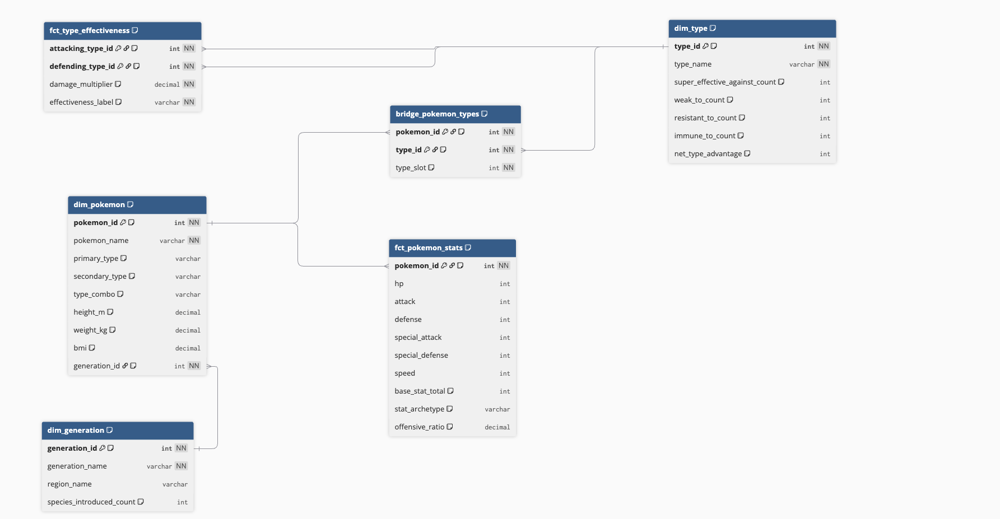

# Nerd Facts — Pokemon Intelligence Platform


> **Business problem:** Greta is closing in on retirement as the business's sole Nerd Facts expert. We need a viable, maintainable replacement for finding fun facts and analytics.

This project replaces Greta with a modern data pipeline that extracts Pokemon data from [PokeAPI](https://pokeapi.co), transforms it into a constellation schema (dimensional model), and serves it through an interactive Evidence dashboard.

## Architecture

```
PokeAPI (REST)
     │
     ▼
┌─────────┐     ┌─────────┐     ┌──────────┐     ┌──────────┐
│   dlt   │────▶│ DuckDB  │────▶│   dbt    │────▶│ Evidence │
│ extract │     │  (raw)  │     │transform │     │  serve   │
└─────────┘     └─────────┘     └──────────┘     └──────────┘
```

| Layer     | Tool     | Purpose                                          |
|-----------|----------|--------------------------------------------------|
| Extract   | dlt      | Pull Pokemon, Types, Generations, and Species from PokeAPI |
| Storage   | DuckDB   | Single-file analytical database                   |
| Transform | dbt      | Staging views → Constellation schema (dims + facts) |
| Serve     | Evidence | Interactive BI dashboards with SQL sources         |

**Tools**
- **dlt** handles API pagination, nested JSON flattening, and schema inference out of the box — no boilerplate HTTP/parsing code.
- **DuckDB** is an embedded OLAP database that requires zero infrastructure — a single file, no server process, and fast analytical queries.
- **dbt** brings software engineering discipline to SQL: version-controlled models, automated tests, and a dependency DAG.
- **Evidence** turns SQL queries into reactive dashboards using markdown — no frontend framework to learn, and the dashboards live alongside the code.

## Data Model



This model doesn't strictly follow a traditional Star Schema, but rather it is a **constellation schema**  — multiple fact tables sharing conformed dimensions. Kimball explicitly endorses this as the natural evolution when a domain has multiple business processes at different grains.¹ The alternative — cramming everything into one star — would violate the fundamental rule that a fact table should have exactly one grain.

### Why not a single star?

A pure star schema has one fact table in the center with denormalized dimensions radiating outward. This model has **two distinct analytical grains** that can't collapse into a single fact table:

- **`fct_pokemon_stats`** operates at the **Pokemon grain** (one row per Pokemon) — answering questions like "what is Charizard's base stat total?" or "which Pokemon has the highest speed?"
- **`fct_type_effectiveness`** operates at the **type-matchup grain** (one row per attacking–defending pair) — answering questions like "what types are super effective against Water?" or "which type has the best net advantage?"

Forcing these into one table would either duplicate data massively or lose granularity.

### Design justification for each non-star element

**Bridge table (`bridge_pokemon_types`):** A Pokemon can have 1–2 types, creating a many-to-many relationship that can't be fully denormalized into `dim_pokemon` without losing the ability to query "all Pokemon of type X." The model partially denormalizes by putting `primary_type` and `secondary_type` on `dim_pokemon` for convenience, while the bridge preserves the full relationship for type-based analysis.

**Snowflaked dimension (`dim_generation`):** Generation is a stable, low-cardinality dimension (9 rows) that `dim_pokemon` references via `generation_id`. While `region_name` and `species_introduced_count` could be denormalized directly onto `dim_pokemon`, keeping `dim_generation` separate avoids update anomalies and positions it as a **conformed dimension** that future fact tables (e.g. `fct_pokemon_encounters` at a generation grain) could reference independently — making it a first-class citizen in the constellation, not just an outrigger.

**Role-playing dimension (`dim_type`):** `fct_type_effectiveness` has two foreign keys to `dim_type` — one for the attacking type and one for the defending type. This is standard Kimball practice for the same dimension playing different analytical roles, identical to how `order_date` and `ship_date` both reference `dim_date` in a sales model.

### Relationships (6 tested FKs)

- `dim_pokemon.generation_id` → `dim_generation`
- `bridge_pokemon_types.pokemon_id` → `dim_pokemon`
- `bridge_pokemon_types.type_id` → `dim_type`
- `fct_pokemon_stats.pokemon_id` → `dim_pokemon`
- `fct_type_effectiveness.attacking_type_id` → `dim_type`
- `fct_type_effectiveness.defending_type_id` → `dim_type`

**Dimensions:** `dim_pokemon`, `dim_type`, `dim_generation`
**Facts:** `fct_pokemon_stats`, `fct_type_effectiveness`
**Bridge:** `bridge_pokemon_types` (resolves Pokemon ↔ Type many-to-many)

¹ [Kimball Dimensional Modeling Techniques](https://www.kimballgroup.com/data-warehouse-business-intelligence-resources/kimball-techniques/dimensional-modeling-techniques/)

## Getting Started

### Prerequisites

| Dependency     | Version | Check with               | Install |
|----------------|---------|--------------------------|---------|
| Python         | 3.13+   | `python3 --version`      | [python.org](https://www.python.org/downloads/) |
| uv             | 0.5+    | `uv --version`           | `curl -LsSf https://astral.sh/uv/install.sh \| sh` |
| Node.js        | 18+     | `node --version`         | [nodejs.org](https://nodejs.org/) |
| npm            | 9+      | `npm --version`          | Included with Node.js |
| Make (optional)| any     | `make --version`         | Pre-installed on macOS/Linux. For Windows PowerShell, you can download it with `choco install make` https://community.chocolatey.org/packages/make|

### Quick Start (Make)

The fastest way to run the full pipeline:

```bash
# 1. Install Python dependencies (creates .venv automatically)
uv sync

# 2. Activate virtual environment
For MacOS & Linux: source .venv/bin/activate
For Windows: .venv\Scripts\activate

# 3. Install Evidence dependencies (first time only)
cd evidence && npm install && cd ..

# 4. Run the full pipeline: extract → transform → test → sync
make all

```
That's it.
Open http://localhost:3000 to explore the dashboards.

### Step-by-Step (without Make)

If you prefer to run each step manually:

```bash
# 1. Install Python dependencies (creates .venv automatically)
uv sync

# 2. Activate virtual environment
For MacOS & Linux: source .venv/bin/activate
For Windows: .venv\Scripts\activate

# 3. Extract data from PokeAPI (fetches 151 Pokemon + types + generations)
cd extract && uv run python pokemon_pipeline.py && cd ..

# 4. Install dbt dependencies (You only need to do this once per installation)
cd transform && uv run dbt deps

# 5. Run dbt transformations (staging views → star schema)
uv run dbt run

# 6. Run dbt tests (validates PKs, FKs, and accepted values)
uv run dbt test && cd ..

# 7. Copy DuckDB into Evidence sources
cp data/nerd_facts.duckdb evidence/sources/pokemon/nerd_facts.duckdb

# 8. Install Evidence dependencies (first time only)
cd evidence && npm install

# 9. Load source data
npm run sources 

# 10. Start the Evidence dev server
npx evidence dev
```

### Make Targets

You can list all available Make targets with `make help`:

| Target           | Description                                    |
|------------------|------------------------------------------------|
| `make all`       | Full pipeline: extract → transform → test → sync |
| `make extract`   | Run dlt extraction only                        |
| `make transform` | Run dbt models only                            |
| `make test`      | Run dbt tests only                             |
| `make evidence-dev`  | Sync DB + start Evidence dev server        |
| `make evidence-build`| Sync DB + build static site for deployment |
| `make clean`     | Remove all generated artifacts                 |

## Dashboard Pages

| Page         | Content                                                     |
|--------------|-------------------------------------------------------------|
| `/`          | Overview — record holders, type distribution, top 10 by BST |
| `/types`     | Type analysis — offensive/defensive profiles, matchup heatmap |
| `/pokedex`   | Full searchable Pokedex with stats, flavor text, and sprites |
| `/compare`   | Head-to-head Pokemon stat comparison                        |
| `/generations` | Species count per generation and region                   |

## Project Structure

```
nerd-facts-pokemon/
├── extract/                    # dlt extraction layer
│   ├── pokemon_pipeline.py     #   PokeAPI → DuckDB pipeline (REST API + species)
│   └── .dlt/
│       └── config.toml         #   dlt configuration (base_url, pokemon_limit)
├── transform/                  # dbt transformation layer
│   ├── dbt_project.yml
│   ├── profiles.yml            #   DuckDB connection (relative path to data/)
│   ├── macros/
│   │   └── title_case.sql      #   DRY macro for title-casing strings
│   └── models/
│       ├── staging/            #   Clean + rename raw tables (1:1 with source)
│       │   ├── _sources.yml    #     Source definitions for pokemon schema
│       │   ├── _schema.yml     #     PK tests on all staging models
│       │   ├── stg_pokemon.sql
│       │   ├── stg_pokemon_stats.sql
│       │   ├── stg_pokemon_types.sql
│       │   ├── stg_pokemon_abilities.sql
│       │   ├── stg_pokemon_species.sql
│       │   ├── stg_generations.sql
│       │   ├── stg_generation_species.sql
│       │   ├── stg_types.sql
│       │   └── stg_type_effectiveness.sql
│       └── marts/              #   Star schema serving layer
│           ├── _schema.yml     #     FK relationships + accepted_values tests
│           ├── dim_pokemon.sql
│           ├── dim_type.sql
│           ├── dim_generation.sql
│           ├── bridge_pokemon_types.sql
│           ├── fct_pokemon_stats.sql
│           └── fct_type_effectiveness.sql
├── evidence/                   # Evidence BI layer
│   ├── sources/pokemon/        #   DuckDB connection config
│   └── pages/                  #   Dashboard markdown pages
│       ├── index.md            #     Home / overview
│       ├── types.md            #     Type analysis deep dive
│       ├── pokedex.md          #     Searchable Pokedex table
│       ├── compare.md          #     Pokemon stat comparison
│       └── generations.md      #     Generation breakdown
├── data/                       # DuckDB database (gitignored)
├── Makefile                    # Pipeline orchestration
├── pyproject.toml              # Python project config + dependencies
├── uv.lock                     # Locked dependency versions
└── .gitignore
```

## Design Decisions

| Decision | Rationale |
|----------|-----------|
| **DuckDB over Postgres** | Zero infrastructure — single file, embedded, fast for analytics. No server to manage for a dataset of this size. |
| **Constellation schema over flat tables** | Two analytical grains (per-Pokemon stats, per-type-matchup effectiveness) require separate fact tables sharing conformed dimensions. Adding a new fact table (e.g. moves) doesn't require restructuring existing models. |
| **dlt REST API config + custom resource** | The declarative `RESTAPIConfig` handles pagination and list→detail chaining for Pokemon/Types/Generations. Pokemon Species needed a custom `@dlt.resource` because it lacks a list endpoint. |
| **Bridge table for types** | Pokemon can have 1–2 types. A bridge table correctly models this many-to-many relationship instead of forcing dual columns into every query. |
| **`title_case` macro** | Three models needed the same title-casing logic. A shared Jinja macro keeps it DRY. |

## Testing Strategy

dbt tests validate the star schema at two levels:

**Staging (data quality):** Every staging model has `unique` + `not_null` tests on its primary key columns, catching issues from PokeAPI early.

**Marts (referential integrity):** All foreign key relationships are tested with `relationships` tests (e.g. `dim_pokemon.generation_id` → `dim_generation`). Business logic is validated with `accepted_values` tests on `stat_archetype` and `effectiveness_label`.

Run all tests:

```bash
cd transform && dbt test
```

## Proposal: Next Steps

### Short-term

1. **Expand to all generations** — The pipeline currently extracts Gen I (151 Pokemon). Changing `pokemon_limit` in `.dlt/config.toml` scales to all ~1000+ Pokemon with no code changes. The star schema and dashboard already support multi-generation data.

2. **Add moves data** — PokeAPI exposes move endpoints with type, power, accuracy, and learnsets. A new `fct_pokemon_moves` fact table would enable queries like "which Water-type moves have 100+ power?" and power a moveset builder page in Evidence.


3. **CI/CD** — A GitHub Actions workflow running `make all` on every push would catch broken models or failing tests before merge. The pipeline is already fully deterministic (same API, same output), making CI straightforward.

### Medium-term

4. **Orchestration** — Even though we work with static data, theoretically speaking, we can schedule periodic refreshes, monitor pipeline health, and alert on failures. The current Makefile targets map cleanly to orchestrator tasks.

5. **dbt exposures** — Register Evidence dashboard pages as dbt exposures, connecting the lineage from raw source → staging → mart → dashboard. This makes impact analysis visible: "if I change `dim_type`, which dashboards break?"

### Long-term

6. **MotherDuck** — Migrate from local DuckDB to MotherDuck for shared cloud access and concurrency. The team could query the same database without file distribution, and dlt/dbt both support MotherDuck as a destination.

7. **Natural language interface** — Connect the schema to an LLM-powered text-to-SQL tool so non-technical users can ask questions like "which Water types are faster than Pikachu?" without writing SQL.
